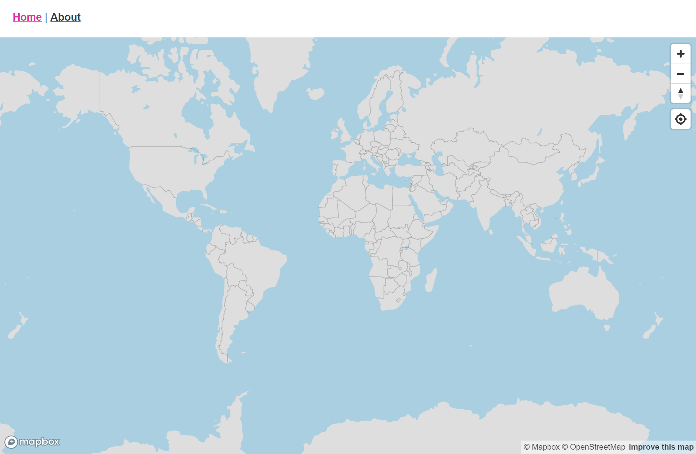

# vue-mapbox-template
```
The is a starter template for a website that uses Vuejs and Mapbox-GL. It also includes some other useful features like module building and bundling using vue-cli, as well as linting on save. To continue development on this template please see the following links.
```

### Links
See [Vuejs](https://www.vuejs.org/).
See [VueMapbox](https://soal.github.io/vue-mapbox/).

### Screenshot

